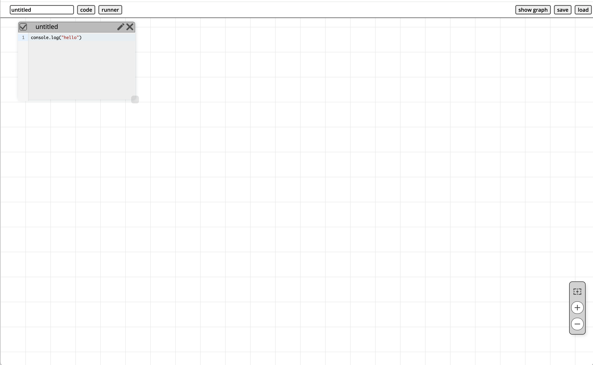
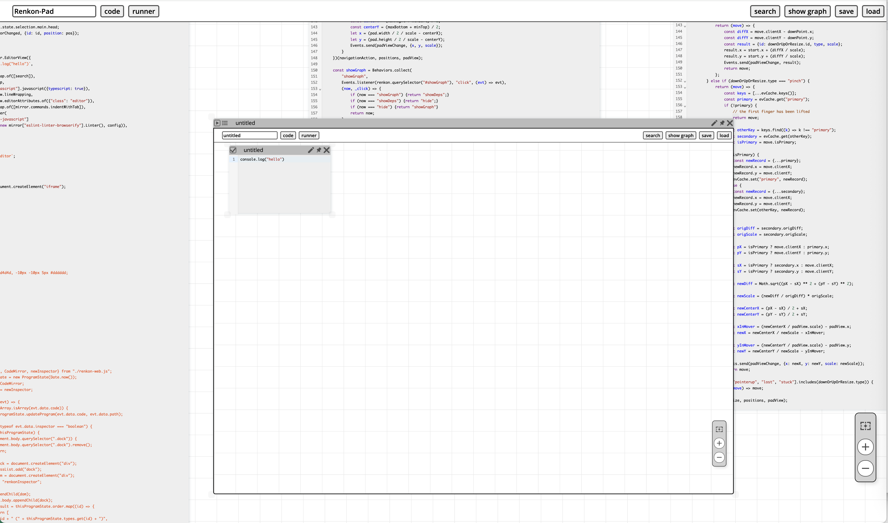
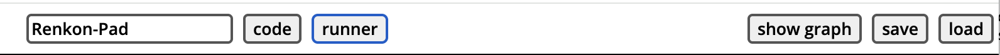
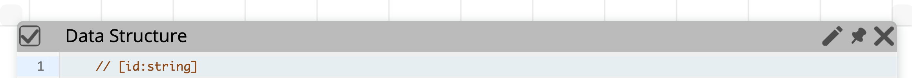
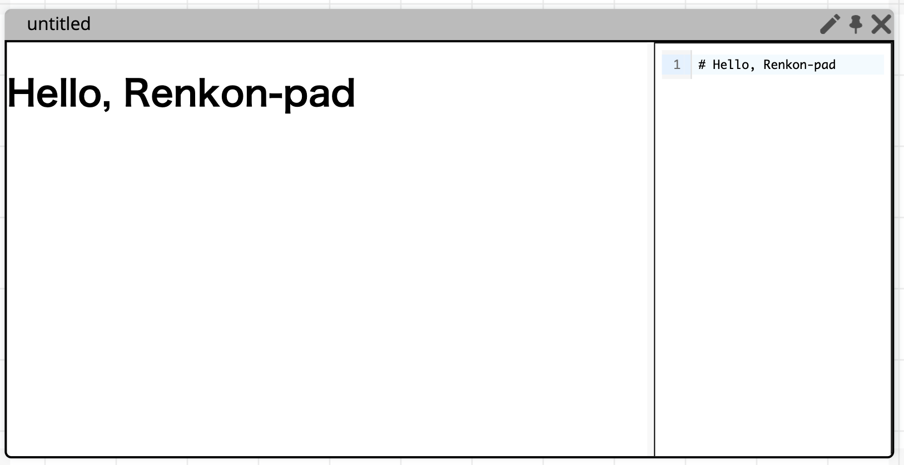
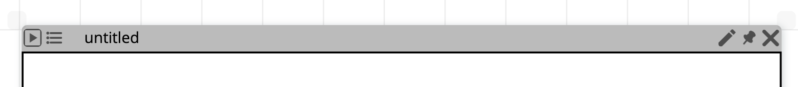
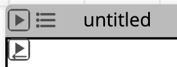
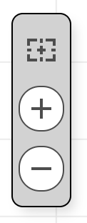

# Renkon-pad: A Live and Self-Sustaining Programming Environment Based on Functional Reactive Programming

## Discussion

Join the [Discord server](https://discord.gg/KKhUjmTn9q) for quick conversations. You are also welcome to [create an issue](https://github.com/yoshikiohshima/renkon-pad/issues) on GitHub.

You can also check out some other examples in [this repo](https://github.com/yoshikiohshima/renkon-pad-examples). You can load a .renkon file.

There are some standalone apps, such as the [Presenter](https://yoshikiohshima.github.io/renkon-presenter/) and [Garupa](https://yoshikiohshima.github.io/renkon-garupa/).

## Introduction

**Renkon-pad** is a live programming environment that allows you to create graphical, web-based applications interactively. The language used is called **Renkon**—see the [`renkon-core`](https://github.com/yoshikiohshima/renkon) repository for more information.

Renkon-pad lets you create multiple text boxes and "runner" iframes where the code in the text boxes can be executed. Renkon-pad is powerful enough to create large applications, including the environment itself. One might think of the environment as a typical boxes-and-wires dataflow visual programming environment, but you can simply write text-based code in the dataflow semantics to build large projects.

Try Renkon-pad on [GitHub Pages](https://yoshikiohshima.github.io/renkon-pad/).

Also, it is now hooked up with the Croquet library so that one can create a real-time collaborative application, and do so in collaborative manner. Check out [Croquet and Renkon-pad](#croquet) section.

## The Interface

The Renkon-pad screen looks like this:

</img>

As the very first step, press the "runner" button near the top-left corner to create a runner window, then press the "play" button in the runner's title bar. You will see "hello" logged in the developer console.

The screenshot below shows a Renkon-pad session that is editing and running a nested Renkon-pad:

</img>

## The Interface

Renkon-pad has several buttons and controls for interacting with the environment.

### The Top Bar

</img>

The top bar includes one text field and five buttons:

- The text field lets you enter the name of your project.
- The first three buttons, **code**, **doc**, and **runner**, create a new text box, a doc box, and a new runner, respectively.
- The search button brings up the search panel that looks up text from all text boxes.
- The fourth button cycles through three states: **"show deps"**, **"show graph"**, and **"hide graph"**:
  - **Show deps**: Hovering over a node definition shows its dependencies.
  - **Show graph**: Hovering over a text box displays its imports and exports.
  - **Hide graph**: Disables both overlays.

You can move to the definition of an input name shown in the blue "show deps" pop up by pressing the name.

- The **"save"** button saves window positions and contents to a file named after the project with a `.renkon` suffix.

### Text Box

</img>

Each text area uses CodeMirror for editing. The title bar contains:

- A **checkmark** button in the top-left corner to enable or disable the box (this affects runners; see below),
- An **edit** button that lets you change the label in the title bar,
- A **pin** button that keeps the position and extent of the text box even when you pan or zoom the view.
- A **close** button that closes the text box.

### Doc Box

</img>

The Doc Box allows you to write your documentation in Markdown. The right side is a text editor for markdown, and the left side is the rendered result. The separator between those two panes can be moved to change the sizes of the panes.

The Markdown format also allows HTML notation. You can use `iframe` or other elements to extend the documentation.

### Runner

</img>

A runner is a separate Renkon execution context in an iframe. A runner has:

- A **play** button,
- An **inspector** toggle button,
- An **edit** button that lets you change the label in the title bar,
- A **pin** button that keeps the position and extent of the text box even when you pan or zoom the view.
- A **close** button.

The **play** button gathers the contents of all enabled text boxes and runs them in the runner iframe as a Renkon program. The **inspector** button toggles the visibility of the resolved stream values.

If you press-hold the play button, you get the secondary button as shown below:

</img>

The secondary button fully replaces the runner's iframe along with a fresh one creates a new Renkon execution context and run the program. This is useful when you want to keep the same runner window but avoid carrying over states.

### Manipulation of windows

You can resize the text box or the runner using the resize handles at four corners. To bring a window to the front, drag the title bar.

The pin feature keeps the window at the same visual location while you
pan and zoom. Note, however, that the "actual" position of the window
does not change. It is purely the view side feature.

### Navigation Box and Pan and Zoom

</img>

A floating widget at the bottom right includes:

- A **home** button, which repositions the view so all windows are visible,
- **Zoom in** and **zoom out** buttons.

You can also zoom using a pinch gesture on a touchpad or by holding **Ctrl** and scrolling with the mouse. *Note: These gestures must be performed on the background, not within a window.* You can also pan by dragging the background.

By default, runners do not handle gestures so that user programs have full control. However, this means pinch gestures on a runner will trigger the browser's default zoom behavior, potentially zooming the entire page. If the navigation box disappears from view, use the browser's **View > Actual Size** menu or zoom back in on a runner.

Double-clicking a window’s title bar centers that window in the view.

### Other Ways to Start Renkon-pad

You can launch a saved `.renkon` file as a standalone app without loading the full Renkon-pad UI:

- Use `index.html?pad=some.renkon`.
- Alternatively, copy `index.html` to a new file (e.g., `abc.html`) and load it in the browser. If the HTML filename is not `index`, the startup code will look for a `.renkon` file with the same base name and load it automatically.

To start Renkon-pad and immediately load a file for editing, use:  
`index.html?file=abc.renkon`

### Typical Idioms and Workflow

The implementation of Renkon-pad is in `index.renkon`. Reading its code and document in it gives the general idea of how to organize code for an application. There are smaller examples in https://github.com/yoshikiohshima/renkon-pad-examples. The `pad-demo-scripts` directory of the repo contains some "party tricks" to illustrate of the power of Renkon-pad.

Unless you've customized `index.html` to have some DOM element by default, the body of the document created from the index.html is empty-you'll need to set up your app’s DOM elements manually. The typical pattern is to use an immediately invoked function expression (IIFE) that creates DOM elements via `createElement`, `appendChild`, etc.

The IIFE should return either the created DOM element or a promise that resolves when all required resources are ready. Other nodes can then depend on this node to initialize consistently.

It is good practice to create several text boxes and group your Renkon nodes within them. You can usually make the text box tall enough so that you don't need to scroll within it. Instead, use Renkon-pad’s pan and zoom features to navigate different parts of the text.

You can create multiple runners. This is useful for comparing different versions of your code. Pressing a runner’s **play** button re-runs the code, although subtle rules determine which nodes are re-evaluated. When in doubt, create a fresh runner.

Be sure to save your project regularly, although Renkon-pad is quite robust.

### Development Tips

Keep the browser's developer tools open during development. You can insert `debugger` statements inside reactive functions. Node names act as file names, so you’ll find them under the "Sources" tab in the developer tools as transpiled code.

Use `console.log` generously during development. Clicking the filename in the console output usually opens the corresponding transpiled code.

## Croquet
When requested, Renkon-pad uses Croquet to enable multiuser collaboration. Renkon-pad uses the following rule to find the Croquet parameters.

- If there is a file called apiKey.js for non-local deployment (that is, the host name does not start with `localhost`) or apiKey-dev.js for local development, the object exported from the js file is loaded.
- On top of that the values in the text box named "Croquet" is merged. The Croquet text box in the Renkon-pad implementation looks like this:

<code>
({
  parameters: {
    appParameters: {
      name: '12346ac',
      password: '1',
      apiKey: "234567_Paste_Your_Own_API_Key_Here_7654321",
      box: "http://localhost:8888",
      eventRateLimit: 60,
    },
    "realm": {"model": [
      "windows", "windowTypes", "positions", "titles", "windowEnabled",
      "zIndex", "windowContentsModel", "padTitle", "docSeparators", "initialData",
      "newId", "padViews", "newWindowRequest", "padTitle", "viewJoin",
      "viewExit", "xxx", "loadReceiver", "loadHandler", "runRequest", "resetRequest"]},
    "name": "pad"
  },
  methods: {
    ...
  }
})
</code>

- The value of `q=` parameter in the URL is merged as "name" of appParameters, and the `#pw=` parameters is merged as "password" parameter.

If the combined parameter object has `name`, Renkon-pad determines that a Croquet session with given parameter to be started. Otherwise, it simply runs as single-user.

When starting up in the multi-user mode, the node definitions are split into the Croquet model and Croquet view. That is, there are two Renkon ProgramState created, one for the Croquet model and another for Croquet view.

The `realm.model` array specifies the names of the nodes that go to the Croquet model. All the rest, including unnamed ones go to the view. The dependency from a view node to model nodes introduces an `Events.receiver()` to be created. Furthermore, a Croquet event is sent to fill the value. When model evaluates the ProgramState on the, model side the Croquet model sends a Croquet model-to-view event, and the view updates its ProgramState based on the change.

