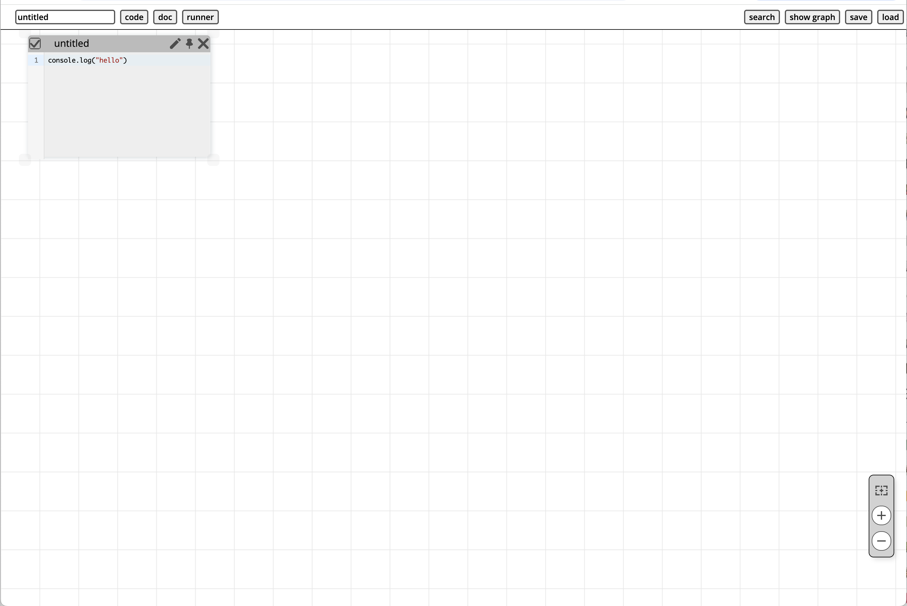
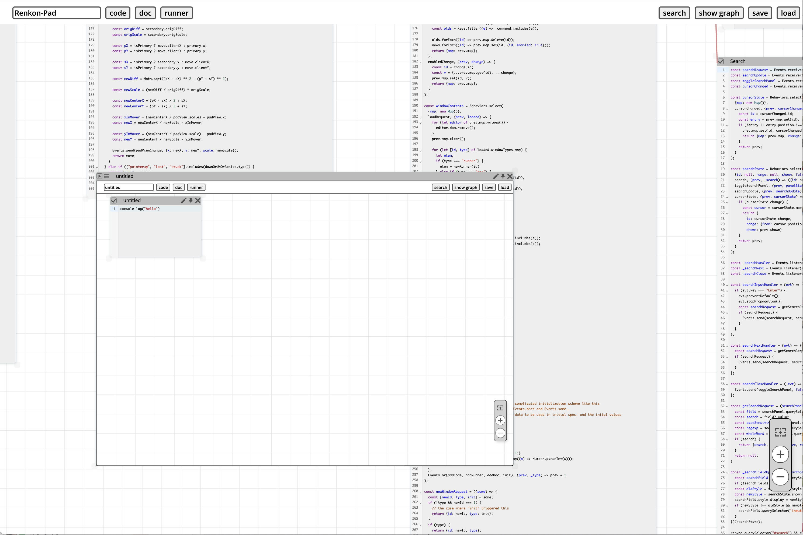
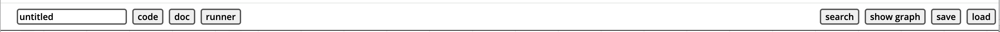
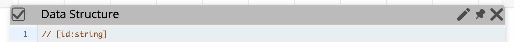
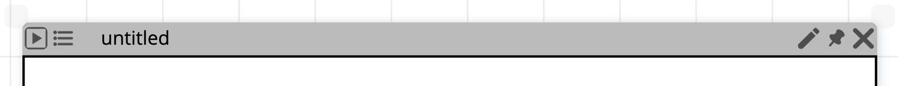

# Renkon-pad: A Live and Self-Sustaining Programming Environment Based on Functional Reactive Programming

## Discussion

Join the [Discord server](https://discord.gg/KKhUjmTn9q) for quick conversations. You are also welcome to [create an issue](https://github.com/yoshikiohshima/renkon-pad/issues) on GitHub.

## Introduction

**Renkon-pad** is a live programming environment that allows you to create graphical, web-based applications interactively. The language used is called **Renkon**—see the [`renkon-core`](https://github.com/yoshikiohshima/renkon) repository for more information.

Renkon-pad lets you create multiple text boxes and "runner" iframes where the code in the text boxes can be executed. Renkon-pad is powerful enough to create large applications, including the environment itself. One might think of the environment as a typical boxes-and-wires dataflow visual programming environment, but you can simply write text-based code in the dataflow semantics to build large projects.

Try Renkon-pad on [GitHub Pages](https://yoshikiohshima.github.io/renkon-pad/).

The initial screen looks like this:

</img>

As the very first step, press the "runner" button near the top-left corner to create a runner window, then press the "play" button in the runner's title bar. You will see "hello" logged in the developer console.

The screenshot below shows a Renkon-pad session that is editing and running a nested Renkon-pad:

</img>

## The Interface

Renkon-pad has several buttons and controls for interacting with the environment.

### The Top Bar

</img>

The top bar includes one text field and five buttons:

- The text field lets you enter the name of your project.
- The first two buttons, **code** and **runner**, create a new text box and a new runner, respectively.
- The search button brings up the search panel that looks up text from all text boxes.
- The fourth button cycles through three states: **"show graph"**, **"show deps"**, and **"hide graph"**:
  - **Show graph**: Hovering over a text box displays its imports and exports.
  - **Show deps**: Hovering over a node definition shows its dependencies.
  - **Hide graph**: Disables both overlays.

- The **"save"** button saves window positions and contents to a file named after the project with a `.renkon` suffix.

### Manipulating Text Box and Runner

</img>

Each text area uses CodeMirror for editing. The title bar contains:

- A **checkmark** button in the top-left corner to enable or disable the box (this affects runners; see below),
- An **edit** button that lets you change the label in the title bar,
- A **pin** button that keeps the position and extent of the text box even when you pan or zoom the view.
- A **close** button that closes the text box.

</img>

A runner is a separate Renkon execution context in an iframe. A runner has:

- A **play** button,
- An **inspector** toggle button,
- An **edit** button that lets you change the label in the title bar,
- A **pin** button that keeps the position and extent of the text box even when you pan or zoom the view.
- A **close** button.

The **play** button gathers the contents of all enabled text boxes and runs them in the runner iframe as a Renkon program. The **inspector** button toggles the visibility of the resolved stream values.

You can resize the text box or the runner using the resize handles at four corners. To bring a window to the front, drag the title bar.

The pin feature keeps the window at the same visual location while you
pan and zoom. Note, however, that the "actual" position of the window
does not change. It is purely the view side feature.

### Navigation Box and Pan and Zoom

</img>

A floating widget at the bottom right includes:

- A **home** button, which repositions the view so all windows are visible,
- **Zoom in** and **zoom out** buttons.

You can also zoom using a pinch gesture on a touchpad or by holding **Ctrl** and scrolling with the mouse. *Note: These gestures must be performed on the background, not within a window.* You can also pan by dragging the background.

By default, runners do not handle gestures so that user programs have full control. However, this means pinch gestures on a runner will trigger the browser's default zoom behavior, potentially zooming the entire page. If the navigation box disappears from view, use the browser's **View > Actual Size** menu or zoom back in on a runner.

Double-clicking a window’s title bar centers that window in the view.

### Other Ways to Start Renkon-pad

You can launch a saved `.renkon` file as a standalone app without loading the full Renkon-pad UI:

- Use `index.html?pad=some.renkon`.
- Alternatively, copy `index.html` to a new file (e.g., `abc.html`) and load it in the browser. If the HTML filename is not `index`, the startup code will look for a `.renkon` file with the same base name and load it automatically.

To start Renkon-pad and immediately load a file for editing, use:  
`index.html?file=abc.renon`

### Typical Idioms and Workflow

Check out `renkon-pad.renkon`, `llama.renkon`, and `cf.renon` for examples.

Unless you've customized `index.html`, the body of the document is empty—you'll need to set up your app’s DOM elements manually. The typical pattern is to use an immediately invoked function expression (IIFE) that creates DOM elements via `createElement`, `appendChild`, etc.

The IIFE should return either the created DOM element or a promise that resolves when all required resources are ready. Other nodes can then depend on this node to initialize consistently.

It is good practice to create several text boxes and group your Renkon nodes within them. You can usually make the text box tall enough so that you don't need to scroll within it. Instead, use Renkon-pad’s pan and zoom features to navigate different parts of the text.

You can create multiple runners. This is useful for comparing different versions of your code. Pressing a runner’s **play** button re-runs the code, although subtle rules determine which nodes are re-evaluated. When in doubt, create a fresh runner.

Be sure to save your project regularly, although Renkon-pad is quite robust.

### Development Tips

Keep the browser's developer tools open during development. You can insert `debugger` statements inside reactive functions. Node names act as file names, so you’ll find them under the "Sources" tab in the developer tools as transpiled code.

Use `console.log` generously during development. Clicking the filename in the console output usually opens the corresponding transpiled code.
